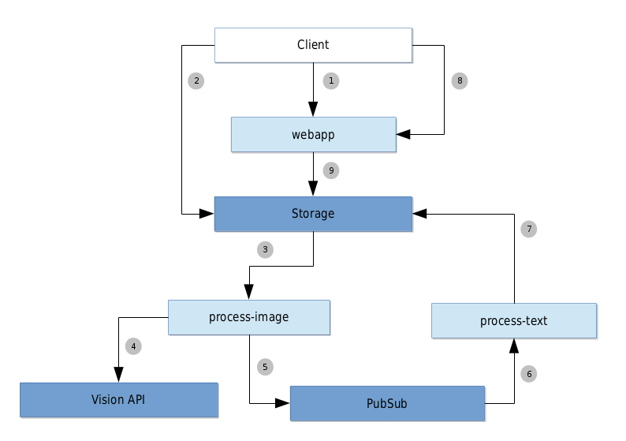

## Overview

This is a demonstration webapp that runs on GCP to perform optical character recognition.

The client uploads an image to the application and then gets the extracted text from the image.

The webapp runs on [Cloud Run](https://cloud.google.com/run/) and two background [Cloud Functions](https://cloud.google.com/functions/) make use of the [Vision API](https://cloud.google.com/vision/), [Cloud Storage](https://cloud.google.com/storage/) and [Cloud PubSub](https://cloud.google.com/pubsub/) to process the work.

1. The client ask the **webapp** for a temporary upload URL,
2. then it uploads an image directly to the Storage
3. The **process-image** function is notified of the new image
4. then uses Vision API to detect text in the image,
5. and then publishes the detected text to PubSub
6. The **process-text** function is notified of a new message from PubSub,
7. then saves it into the Storage
8. Meanwhile, the client pools the webapp,
9. that fetch a result from the Storage
